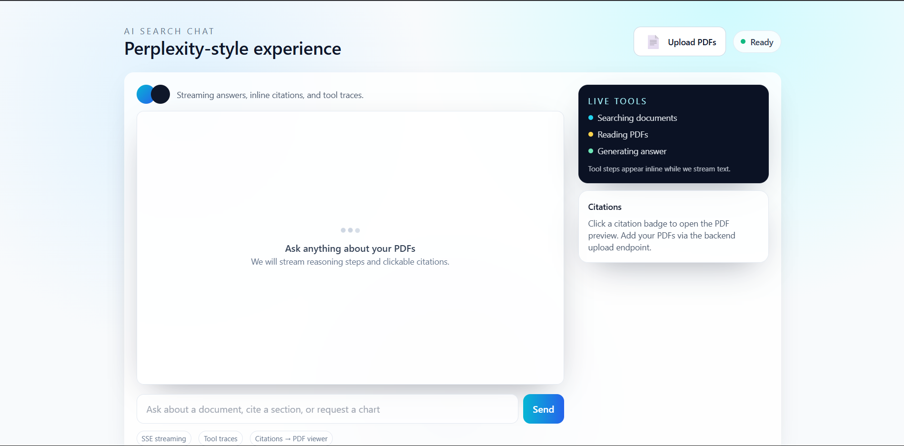

# Intersala-2 — AI Search Chat MVP

This repository contains a minimal MVP for the project described as: a Perplexity-style chat frontend (Next.js) and a FastAPI backend that streams responses over SSE with RAG-based PDF search and Groq LLM integration.

## Screenshot



## Features

- 🔄 **Server-Sent Events (SSE)** streaming for real-time responses
- 📄 **PDF Upload** from frontend with drag-and-drop support
- 🔍 **Simple RAG** (Retrieval-Augmented Generation) searches uploaded PDFs
- 🤖 **Groq LLM Integration** for natural language responses (Mixtral-8x7b)
- 🎨 **Perplexity-style UI** with Tailwind CSS glass-morphism design
- 📌 **Citation System** with clickable references to source PDFs
- ⚡ **Tool Traces** showing reasoning steps in real-time

## Quick start (local, dev)

### 1. Backend Setup

```bash
cd backend
python -m venv .venv
source .venv/bin/activate    # Windows: .venv\Scripts\activate
pip install -r requirements.txt

# Create .env file and add your Groq API key
cp .env.example .env
# Edit .env and add: GROQ_API_KEY=your_key_here
# Get free API key from: https://console.groq.com/keys

uvicorn main:app --reload --host 0.0.0.0 --port 8000
```

### 2. Frontend Setup

```bash
cd frontend
npm install
npm run dev
```

Visit [http://localhost:3000](http://localhost:3000) to use the app.

## How It Works

### Architecture

- **Backend** (`backend/`) — FastAPI app with:
  - `/upload_pdf` — Upload PDFs for search
  - `/generate` — Enqueue a chat request, returns job_id
  - `/stream/{job_id}` — SSE endpoint that streams tool traces, text chunks, and citations
  - `/pdf/{pdf_id}` — Serve PDF files
  - `/pdf_search/{pdf_id}` — Search within a specific PDF
  - Simple RAG implementation in `pdf_utils.py`
  
- **Frontend** (`frontend/`) — Next.js 14 app with:
  - PDF upload UI component
  - Chat interface with SSE client
  - Citation preview drawer (placeholder for react-pdf integration)
  - API proxy at `/api/proxy/*` to forward requests to backend

### RAG Flow

1. User uploads PDFs via frontend
2. User asks a question
3. Backend performs simple keyword-based search across all PDFs
4. Top relevant chunks are sent to Groq LLM as context
5. LLM streams response with citations back to frontend
6. User can click citations to view source PDF

## Environment Variables

Create `backend/.env`:

```bash
GROQ_API_KEY=your_groq_api_key_here
```

Get your free API key from [Groq Console](https://console.groq.com/keys).

## Notes & Next Steps

- **Current RAG**: Simple keyword matching; upgrade to embeddings (OpenAI, Sentence Transformers) for semantic search
- **PDF Viewer**: Add react-pdf integration to highlight cited sections
- **Animations**: Add Framer Motion transitions for citation drawer
- **Streaming**: Currently uses Groq's Mixtral-8x7b; swap models as needed
- **Docker**: Use `docker-compose up` to run both services (optional)

## Docker (Optional)

```bash
docker-compose up
```

This runs both frontend and backend in containers.
